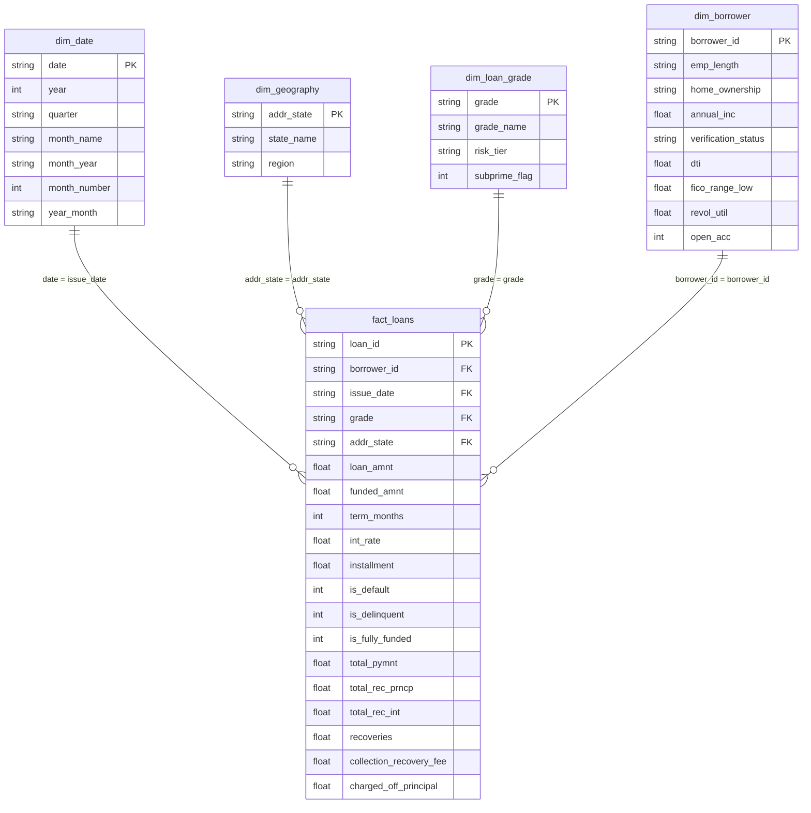

# OPS-TWIN: Power BI Modeling & DAX Implementation Guide

This directory contains the star-schema data exports and exact DAX measures required to assemble the **OPS-TWIN Lending Operations Business Intelligence Report** in Power BI Desktop in under 45 minutes.

---

## 1. Star-Schema Data Model Architecture

The data model adheres to a Kimball star-schema structure centered on `fact_loans`, connected to four specialized dimension tables:



---

## 2. Fast Setup Instructions (3 Steps)

### Step 1: Ingest Star-Schema CSVs
1. Open **Power BI Desktop**.
2. Click **Get Data** → **Text/CSV**.
3. Import the files located in `powerbi/export/`:
   - `fact_loans.csv`
   - `dim_borrower.csv`
   - `dim_date.csv`
   - `dim_geography.csv`
   - `dim_loan_grade.csv`
4. Click **Load**.

### Step 2: Configure Relationships in Model View
Navigate to the **Model View** tab in Power BI and configure the following 1-to-Many (`1:*`), Single cross-filter direction relationships:
- `dim_date[date]` $\rightarrow$ `fact_loans[issue_date]`
- `dim_borrower[borrower_id]` $\rightarrow$ `fact_loans[borrower_id]`
- `dim_geography[addr_state]` $\rightarrow$ `fact_loans[addr_state]`
- `dim_loan_grade[grade]` $\rightarrow$ `fact_loans[grade]`

### Step 3: Create a Dedicated Measures Table
Click **Enter Data** on the Home tab, name the table `_Measures`, and paste the DAX formulas below.

---

## 3. The 12 Core DAX KPI Measures

### Credit Risk Measures
```dax
-- KPI 1: Default / Charge-Off Rate (%)
Default Rate % = 
DIVIDE(
    CALCULATE(COUNTROWS(fact_loans), fact_loans[is_default] = 1),
    COUNTROWS(fact_loans),
    0
)

-- KPI 2: Delinquency Rate (30+ DPD) (%)
Delinquency Rate % = 
DIVIDE(
    CALCULATE(COUNTROWS(fact_loans), fact_loans[is_delinquent] = 1),
    COUNTROWS(fact_loans),
    0
)

-- KPI 3: Risk-Adjusted Portfolio Quality Spread (%)
Risk Adjusted Quality Spread = 
[Weighted Average APR %] - [Default Rate %]
```

### Funding & Portfolio Measures
```dax
-- KPI 4: Funding Fulfillment Rate (%)
Funding Fulfillment Rate % = 
DIVIDE(
    SUM(fact_loans[funded_amnt]),
    SUM(fact_loans[loan_amnt]),
    1.0
)

-- KPI 5: Total Funded Volume ($)
Total Funded Volume = 
SUM(fact_loans[funded_amnt])

-- KPI 5b: Total Applications Count
Total Applications = 
COUNTROWS(fact_loans)

-- KPI 6: Weighted Average APR (%)
Weighted Average APR % = 
DIVIDE(
    SUMX(fact_loans, fact_loans[funded_amnt] * fact_loans[int_rate]),
    SUM(fact_loans[funded_amnt]),
    0
)
```

### Collections & Recovery Measures
```dax
-- KPI 7: Gross Charged-Off Principal ($)
Gross Charged Off Principal = 
SUM(fact_loans[charged_off_principal])

-- KPI 8: Net Recovery Rate on Charged-Off Loans (%)
Net Recovery Rate % = 
DIVIDE(
    SUM(fact_loans[recoveries]),
    [Gross Charged Off Principal],
    0
)

-- KPI 9: Collection Cost Ratio (%)
Collection Cost Ratio % = 
DIVIDE(
    SUM(fact_loans[collection_recovery_fee]),
    SUM(fact_loans[recoveries]),
    0
)

-- Net Recovered Cash Flow ($)
Net Recovered Cash = 
SUM(fact_loans[recoveries]) - SUM(fact_loans[collection_recovery_fee])
```

### Capacity Proxies Measures
```dax
-- KPI 10: Regional Processing Throughput (Monthly Volume / State)
Regional Throughput Volume = 
DIVIDE(
    [Total Funded Volume],
    DISTINCTCOUNT(dim_date[month_year]) * DISTINCTCOUNT(fact_loans[addr_state]),
    0
)

-- KPI 11: Verification Backlog Share (Capacity Proxy %)
Verification Backlog Share % = 
DIVIDE(
    CALCULATE(COUNTROWS(fact_loans), RELATED(dim_borrower[verification_status]) = "not verified"),
    COUNTROWS(fact_loans),
    0
)

-- KPI 12: Month-over-Month Volume Growth (%)
MoM Volume Growth % = 
VAR CurrentMonthVolume = [Total Funded Volume]
VAR PriorMonthVolume = 
    CALCULATE(
        [Total Funded Volume],
        DATEADD(dim_date[date], -1, MONTH)
    )
RETURN
DIVIDE(
    CurrentMonthVolume - PriorMonthVolume,
    PriorMonthVolume,
    0
)

-- Year-over-Year Default Rate Delta (pts)
YoY Default Rate Delta = 
VAR CurrentDefRate = [Default Rate %]
VAR PriorYearDefRate = 
    CALCULATE(
        [Default Rate %],
        DATEADD(dim_date[date], -1, YEAR)
    )
RETURN
CurrentDefRate - PriorYearDefRate
```

---

## 4. Recommended 3-Page Report Visual Layout

### Page 1: Executive Portfolio Cockpit
- **Top Row (Cards)**:
  - Total Funded Volume (`Total Funded Volume`)
  - Default Rate (`Default Rate %`)
  - Fulfillment Rate (`Funding Fulfillment Rate %`)
  - Net Recovery Rate (`Net Recovery Rate %`)
- **Main Visual (Combo Chart)**:
  - X-Axis: `dim_date[month_year]`
  - Column Y-Axis: `Total Funded Volume`
  - Line Y-Axis: `Default Rate %`
- **Bottom Left (Bar Chart)**:
  - Category: `dim_loan_grade[grade]`
  - Value: `Default Rate %` vs `Weighted Average APR %`
- **Bottom Right (Map / Filled Map)**:
  - Location: `dim_geography[state_name]`
  - Color saturation: `Total Funded Volume`

### Page 2: Credit Risk & Root-Cause Drilldown
- **Crisis Callout (Card / Text Box)**: Highlights 2008 Financial Crisis spike (peaking at 26.2% default rate).
- **Matrix Visual**:
  - Rows: `dim_loan_grade[grade]`, `dim_borrower[home_ownership]`
  - Columns: `dim_date[year]`
  - Values: `[Default Rate %]`, `[Gross Charged Off Principal]`
- **Scatter Plot**:
  - X-Axis: `dim_borrower[dti]`
  - Y-Axis: `dim_borrower[fico_range_low]`
  - Legend: `dim_loan_grade[risk_tier]`
  - Size: `fact_loans[loan_amnt]`

### Page 3: Collections & Underwriting Capacity
- **Collections Funnel Visual**:
  - Level 1: `Gross Charged Off Principal`
  - Level 2: `SUM(fact_loans[recoveries])`
  - Level 3: `[Net Recovered Cash]`
- **Capacity Backlog Bar Chart**:
  - X-Axis: `dim_date[year_month]`
  - Y-Axis: `[Verification Backlog Share %]`
- **Efficiency Table**:
  - Columns: State, Processing Throughput, Unverified Share %, Realized Default Rate %.
